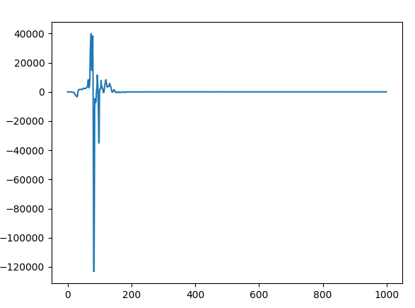
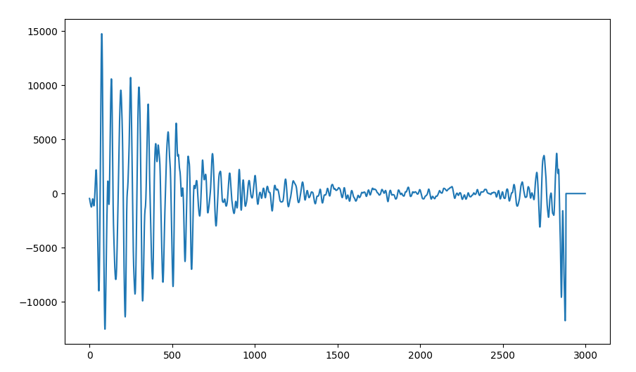
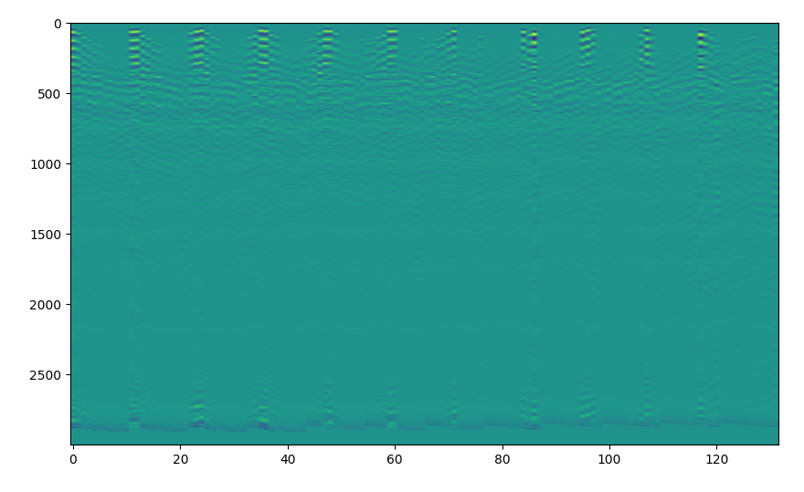

# CE-LPR
PDS data analysis of Chang'e mission LPR/LRPR based on python(基于python嫦娥任务LPR/LRPR 的PDS数据解析)

## PDS4格式

PDS4，是NASA开发的一种专门用于存储行星探索任务的数据系统。数据的后缀有两种：2BL和2B(2CL和2C)。2BL文件是一个XML格式的文件（XML 被设计用来结构化、存储以及传输信息。），里面记录了拍摄器材、拍摄时间和曝光参数等信息，最重要的是它存储了一个文件路径，也就是同名的2B文件，2B文件里面才是实际的图片数据。
## 使用方法

使用Python编辑器打开，修改需要处理的文件路径，运行即可，更多内容请查看以下文章：

[嫦娥工程探月雷达数据解析 ](https://blog.kun.ee/2024/12/22/70/)

## 运行结果
嫦娥4号的单个2B数据图像：

嫦娥5号的一次回波数据：

嫦娥5号的单个2B数据图像：

## 更多数据

更多数据欢迎大家，使用[探月工程数据发布与信息服务系统](https://moon.bao.ac.cn/ceweb/)下载。
